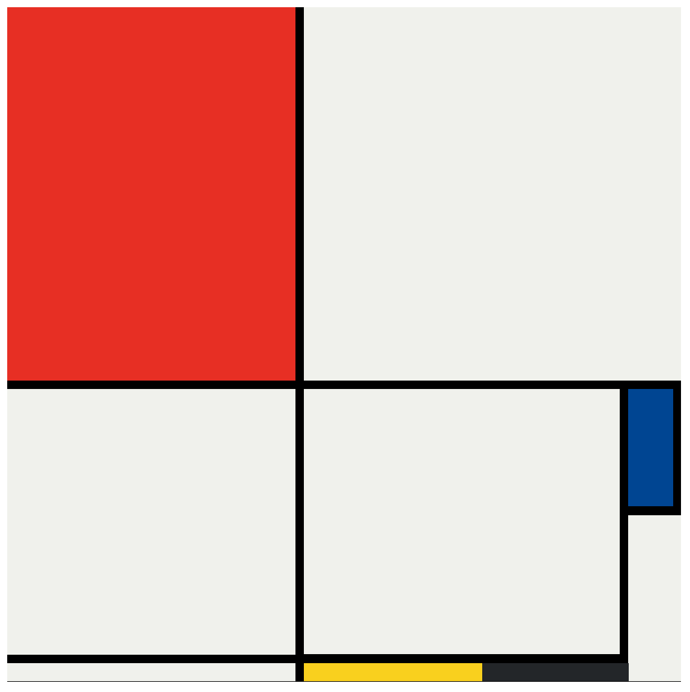

# 🎨 Mondrian Project

A simple CSS Grid layout recreation of **Piet Mondrian’s** famous abstract art style.  
This project uses pure **HTML** and **CSS** (no JavaScript) to create a colorful, geometric composition inspired by Mondrian's paintings.

🌐 **Live Demo**: [View the Mondrian Project](https://catheringino.github.io/Mondrian-project/)

---

## 📸 Preview


---

## ✨ Features
- 🎨 **CSS Grid layout** for perfect alignment of blocks
- 🟥🟦🟨 **Classic Mondrian colors**: red, blue, yellow, black, and white
- 📏 **Responsive design** – adapts to different screen sizes
- 🖌 **Clean and minimalist code**

---

## 🛠️ Technologies Used
- **HTML5** – Structure of the page
- **CSS3** – Layout and styling (CSS Grid)

---

## 🚀 How to Use
1. Open the [Mondrian Project](https://catheringino.github.io/Mondrian-project/).
2. Admire the clean, balanced composition.
3. Experiment with the CSS to create your own Mondrian-inspired design.

---

## 📂 Installation & Setup
If you want to run this project locally:
```bash
# Clone the repository
git clone https://github.com/CatherinGino/Mondrian-project.git

# Open the folder
cd Mondrian-project

# Open index.html in your browser
